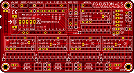
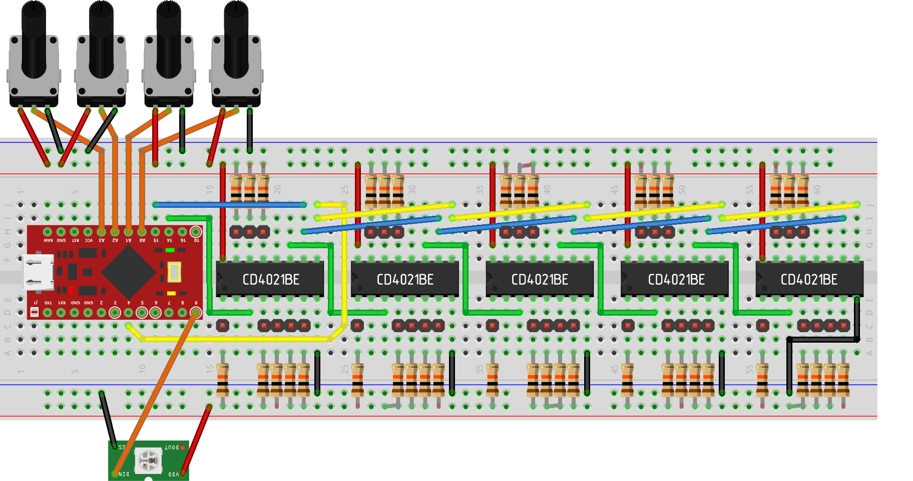

# Joystick Shield RG Custom v1.0
Joystick shield for Arduino Pro Micro with shift registers, i2c text LCD and ws2812 led support.
RG Custom PCB  shield allows you to easy create your own control panel, throttle or joystick device. 

Controller supports: 4 analogue inputs. (256 steps are more than enough to 10k Ohm pots), 40 inputs. Pushbuttons, toggle switches with pulse, rotary encoders, pov hats.
i2c text LCD displays. ws2812 leds.

### To build it you will need.
1. Shield PCB
2. Arduino pro micro
3. 5pcs CD4021BE shift registers
4. 5pcs 10kOhm sip9 array resistors.
5. 2.54mm Male PCB Single Row Straight Header Strip Connectors
6. 1kOhm resistors for leds.

Arduino IDE 1.6.6 (or above) library that adds a joystick to the list of HID devices. This will not work with Arduino IDE 1.6.5 (or below).

### You will need to install 3 additional libraries:
Info on how to install additional libraries can be found here.
https://www.arduino.cc/en/Guide/libraries#toc4

### Libraries included as submodules.
Arduino Joystick library ver 1.0  
LiquidCrystal_I2C  
Adafruit_NeoPixel  

### Link on PCB in OSH Park https://oshpark.com/shared_projects/YERseqpP

### You also can build your own shield, using breadboard.

Buttons (or toggle switches) all have common ground and connected to pins between shift register and resistor.
Instead of 5pcs 10kOhm sip9 array resistors use 40pcs 10kOhm resistors.

## Contacts section:
Facebook https://www.facebook.com/RGcustom/  
RG Custom Discord channel https://discord.gg/tjndHQ7  
E-Mail: rgcustm@gmail.com  
IL-2 Forums (russian): https://forum.il2sturmovik.ru/topic/6511-opensource-kontroller-na-arduino/  
StarCitizen Spectrum thread: https://robertsspaceindustries.com/spectrum/community/SC/forum/50264/thread/open-source-arduino-controller-for-control-panels  

