This is a short and easy manual on how to load joystick sketch to your Arduino board.
# STEP 1
Follow this link to https://www.arduino.cc and download and install latest Arduino IDE software
### First select SOFTWAREand choose DOWNLOADS
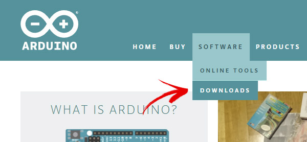
### Then select Windows installer
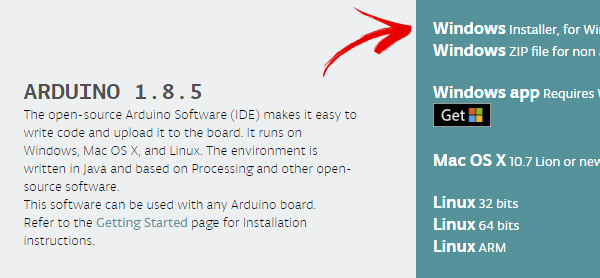
### Install Arduino IDE, following installer instructions.

# STEP 2
Go to Joystick Shield main GitHub directory https://github.com/RGCustom/Joystick-Shield-RG-Custom and download firmware sketches
### First click on Clone or Download green buttons and select Download .ZIP
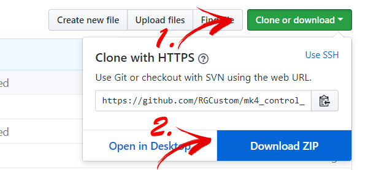

# STEP 3
Now download and install needed libraries 
### Libraries, included as submodules wont download on previous step, so they must be downloaded separately.
### Clicking on library will lead you to its location.
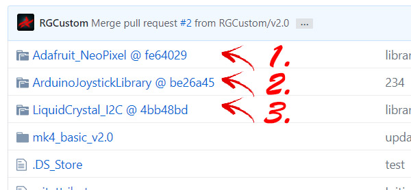
### Click Branch button and select master to get the latest library.
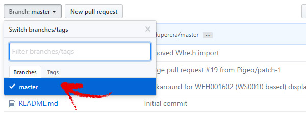
### Donwload library same as you downloaded main sketch.

### Install librariesin your arduino libraries folder.
Arduino manual on installing libraries https://www.arduino.cc/en/Guide/Libraries#toc2
### ArduinoJoystick library has a default installation bat file. 
Default libraries location (you can just unzip them there) is C:\Users\ your user name \Documents\Arduino\libraries
or just go to My Documents > Arduino > libraries

# STEP 4
### Unzip main sketch you downloaded in to a folder.
Select folder with a proper firmware sketch (names may vary)
### Open sketch .INO file. 
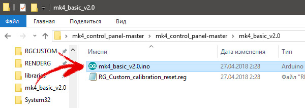

Arduino IDE will open sketch.
### Open Tools menu and select Board -> Arduino Leonardo

### Also select corresponding port number in same menu.
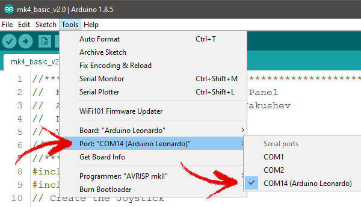

# STEP 5
Prepare Arduino IDE to upload firmware.
### Select Preferences from File menu
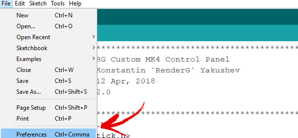
### And in Preferences window mark "Show verbose otput during: upload" checkbox
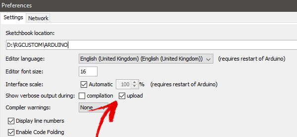

# STEP 6
### Verify sketch by pressing VERIFY button
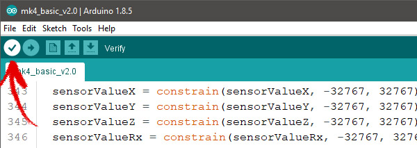
#### If everything is Ok, you will see smth like this

### After that hit upload button
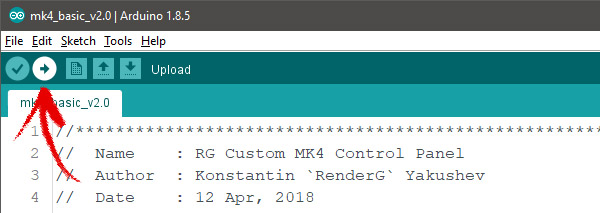

# STEP 7 -= SKIP THIS STEP IF ARDUINO ALREADY HAS UPLOADED JOYSTICK CODE =-
#### After firmware will compile, Arduino IDE will start looking for controller in bootloader state
### And will start scanning ports for arduino, showing smth like
PORTS {COM1, COM2, COM14, } / {COM1, COM2, COM14, } => {}
PORTS {COM1, COM2, COM14, } / {COM1, COM2, COM14, } => {}
### This is when you have to push RESET button o the back of your device.
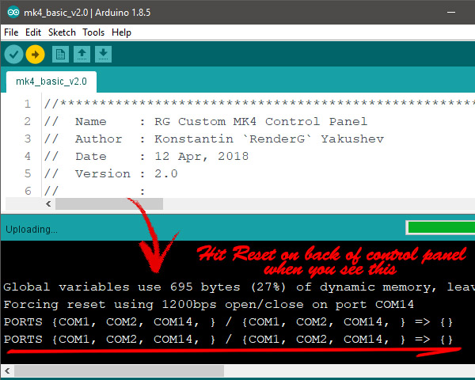
### After upload will be finished, your device will reboot and will be updated.
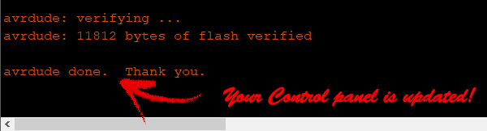

